# Hi there 👋

I'm JulSql, a French full-stack software engineer who loves to code! 👩‍💻

I enjoy building full-stack applications, mobile apps and APIs, from prototypes to production systems used by real people.

---

## 🕹️ Interactive Portfolio 

A playable, retro **Zelda-style portfolio** where every production project is a place to explore on the map. Grab the sword, free Princess Zelda, and walk onto each project's landmark to discover it! Bilingual (FR/EN), with chiptune audio and full keyboard & mouse navigation.

🔗 [portfolio.julsql.fr](https://portfolio.julsql.fr)

## 🧰 Main Stack

---

## 🚧 Currently working on

- ⚡️ Flowpedia: [New project] A infinite flow of wikipedia page to always learn new stuff!
- 🦜 Speciarium: Full refacto of the front for better experience

---

## 🚀 Featured Project

## 🔐 TheCode (main project) 

A cross-platform password ecosystem based on deterministic generation.

TheCode generates unique and strong passwords from a master key and the website name, without storing any credentials.

This approach removes the need for a password database, eliminates synchronization risks, and ensures consistent passwords across all devices.

Available on web, mobile, and browser extensions for a unified experience.

### 🌐 Web App
🔗 [thecode.julsql.fr](https://thecode.julsql.fr)

### 📱 Mobile Apps

- [Android](https://play.google.com/store/apps/details?id=fr.juliette.thecode&hl=en)

- [iOS](https://apps.apple.com/app/thecode-password-manager/id6753169043)

### 🧩 Browser Extensions

- [Chrome](https://chromewebstore.google.com/detail/thecode/jeknefpalcipdlnbeboefonmnlejepen)
- [Firefox](https://addons.mozilla.org/fr/firefox/addon/thecode/)
- [Safari](https://apps.apple.com/app/thecode-password-manager/id6753169043)

### ⌨️ Command tool

- Command line

---

## 🦜 Speciarium 

A species discovery platform where users can document and organize all the species they have encountered.

Users can upload photos of observed species, automatically geolocated on an interactive map. Each entry is enriched with species metadata and global statistics (e.g. number of different mammals observed worldwide).

The platform also allows users to explore public collections from others, with a full user system (authentication, permissions, and privacy controls).

🔗 [speciarium.julsql.fr](http://speciarium.julsql.fr)

---

## 🤖 JIMI 

An AI Chatbot to manage agenda. Available as a website or mobile application.

🔗 Web app: [jimi.julsql.fr](http://jimi.julsql.fr)

🔗 API: [jimi-api.julsql.fr](https://jimi-api.julsql.fr/swagger-ui/index.html#/)

📱 Mobile apps:
- [Android](https://play.google.com/store/apps/details?id=fr.tsp.jimithechatbot&hl=en)
- [iOS](https://apps.apple.com/fr/app/jimi-the-chatbot/id6764839053)

---

## 📸 Exif Tools 

Python-based tool for image metadata editing (GPS, timestamps) with AI-powered species detection.

🔗 https://github.com/julsql/exif-tools/releases/latest

---

## 💬 Codexio 

Books & comics collection manager with ISBN API integration.

🔗 [codexio.julsql.fr](https://codexio.julsql.fr)

---

## 🪶 Rimbot 

Web generator of French poems respecting a free form (sonnet, haiku, ballad…) with imposed rhymes and meters.

🔗 [rimbot.julsql.fr](http://rimbot.julsql.fr)

---

## 🧙‍♀️ Lilianastrade 

A web app for managing a Magic: The Gathering card collection (cards, decks, merchants, editions).
  
🔗 [lilianastrade.julsql.fr](https://lilianastrade.julsql.fr)

---

## 📊 GitHub Stats

  
  

